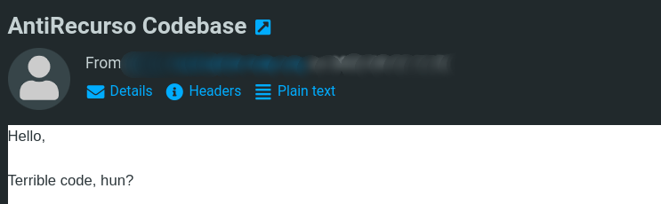
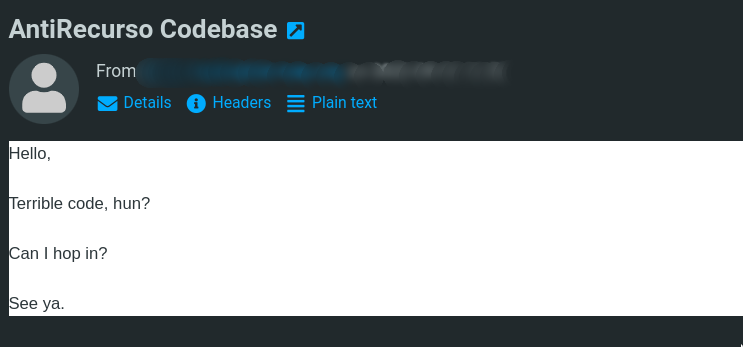

# Software Livre no Núcleo de Estudantes de Informática do ISEP

## O caso do AntiRecurso

---

<!--
header: "**O que é o NEI** _AntiRecurso - Origem_ _AntiRecurso - Desenvolvimento_ _AntiRecurso - Sucesso_ _Takeaways_"
transition: fade
backgroundColor: #fff
color: #000
-->
<style scoped>
  img {
    position: absolute;
    right: 4rem;
    bottom: 50%;
    transform: translateY(50%);
  }
</style>


# O que é o NEI-ISEP?

Núcleo de Estudantes de Informática do ISEP

Desde 2014

---

# Departamento de Informática

<style scoped>
  img {
    position: absolute;
    right: 50%;
    bottom: 15%;
    transform: translateX(50%);
    width: 520px;
  }
</style>

```javascript
if (evento || plataforma || projeto) {
  informatica();
}
```


---

<!--
header: "_O que é o NEI_ **AntiRecurso - Origem** _AntiRecurso - Desenvolvimento_ _AntiRecurso - Sucesso_ _Takeaways_"
_class: lead
-->


---

<style scoped>
  img {
    position: absolute;
    right: 4rem;
    bottom: 50%;
    transform: translateY(50%);
  }
</style>

# Origem

Criado em 2018

Exclusivo Android


---

<!--
header: "_O que é o NEI_ _AntiRecurso - Origem_ **AntiRecurso - Desenvolvimento** _AntiRecurso - Sucesso_ _Takeaways_"
_class: lead
-->

<style scoped>
  h1 {
    font-size: 3rem;
  }
</style>

# ♻️

<!--
Falar sobre a ideia do rewrite
-->

---

# Desafios

<style scoped>
  img {
    position: absolute;
    right: 4rem;
    bottom: 50%;
    transform: translateY(50%);
  }
</style>

Timing

Recursos

Informação disponível


---

# Crawler

<style scoped>
  h1 {
    position: absolute;
    left: 2rem;
    top: 2rem;
  }
  section {
    display: grid;
    grid-template-columns: 1fr 1fr 10fr;

    align-items: center;
    gap: 1rem;
  }
  section code {
    width: 100%;
    font-size: 1.5rem;
  }
</style>


➡

```json
{
    "line": "8) Em x86-64, a instrução “popq %rax” é o equivalente a “movq %rax,(%rsp)” seguido de “subq...",
    "question_number": 8,
    "question": "Em x86-64, a instrução “popq %rax” é o equivalente a “movq %rax,(%rsp)” seguido de “subq $8,%rsp”",
    "options": [
      "Verdadeiro",
      "Falso"
    ],
    "correct_index": 1
  },
  {
    "line": "9) Em x86-64, se atribuirmos valores com sinal aos registos a somar, o resultado será incorreto se a flag ..."
    "question_number": 9,
    "question": "Em x86-64, se atribuirmos valores com sinal aos registos a somar, o resultado será incorreto se a flag..."
    "options": [
      "Verdadeiro",
      "Falso"
    ],
    "correct_index": 1
  },
  {
    "line": "10) Em x86-64, a instrução “movq %rax,%rsp” é o equivalente a “popq %rax” seguido de “addq $8,%rsp”",
    "question_number": 10,
    "question": "Em x86-64, a instrução “movq %rax,%rsp” é o equivalente a “popq %rax” seguido de “addq $8,%rsp”",
    "options": [
      "Verdadeiro",
      "Falso"
    ],
    "correct_index": 1
  }
```

---

<style scoped>
  section {
    display: flex;
    align-items: center;
    justify-content: space-between;
    gap: 1rem;
  }
  p {
    width: 607px;
    height: 361px;
    margin: 0;
  }
  p img {
    width: 100%;
    height: 100%;
  }
</style>


---

<style scoped>
  section {
    display: flex;
    align-items: center;
    justify-content: space-between;
    gap: 1rem;
  }
  p {
    width: 620px;
    height: 360px;
    margin: 0;
  }
  p img {
    width: 100%;
    height: 100%;
  }
</style>


---

<!--
_transition: wiper
-->
<style scoped>
  p {
    height: 420px;
    position: absolute;
    right: 50%;
    bottom: 50%;
    transform: translate(50%, 50%);
  }
</style>



---

<style scoped>
  p {
    height: 420px;
    position: absolute;
    right: 50%;
    bottom: 50%;
    transform: translate(50%, 50%);
  }
</style>



---

<!--
header: "_O que é o NEI_ _AntiRecurso - Origem_ _AntiRecurso - Desenvolvimento_ **AntiRecurso - Sucesso** _Takeaways_"
_class: lead
-->


---

<!--
_class: lead
-->

## 

---

<!--
_class: lead
-->

<style scoped>
  h1 {
    font-size: 2.5rem;
  }
</style>

# 🔜

<!--
Falar sobre os próximos passos:

- Melhorar o crawler (generalizar)
- Novos tipos de perguntas
- Novas funcionalidades
- Não ir preso
-->

---

<!--
header: "_O que é o NEI_ _AntiRecurso - Origem_ _AntiRecurso - Desenvolvimento_ _AntiRecurso - Sucesso_ **Takeaways**"
-->
