<style scoped>
  h1 {
    font-size: 2rem;
  }
</style>

# Software Livre no Núcleo de Estudantes de Informática do ISEP

## O caso do AntiRecurso

<!--
- presidente do NEI
- Vimos falar sobre o uso do software livre no NEI
- agradecer à Associação Nacional para o Software Livre o convite
-->

---

<!--
header: "**O que é o NEI** _AntiRecurso - Origem_ _AntiRecurso - Desenvolvimento_ _AntiRecurso - Sucesso_ _Software Livre_"
footer: "Núcleo de Estudantes de Informática - ISEP "
transition: fade
backgroundColor: #fff
color: #000
-->
<style scoped>
  p > img {
    position: absolute;
    right: 4rem;
    bottom: 50%;
    transform: translateY(50%);
  }
</style>

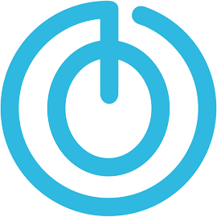

# O que é o NEI-ISEP?

Núcleo de Estudantes de Informática do ISEP

Desde 2014

<!--
Antes de mais, o que é o NEI-ISEP?
-> Grupo formal de estudantes sem fins lucrativos, formado em 2014.
- No ano passado contávamos com mais de 40 membros todos estudantes dos cursos do Departamento de Informática do ISEP.

Organizamos vários eventos como...
-->

---

<style scoped>
  section {
    display: flex;
    align-items: center;
    justify-content: space-around;
    gap: 1rem;
  }
  p {
    margin: 0;
  }
</style>


<!--
- O Fallstack que consiste numa feira de emprego para empresas do ramo da tecnologia poderem ter um contacto direto com os alunos finalistas de forma a encontrarem o seu projeto de estágio.

- O ano passado a edição contou com 16 empresas. E este ano voltar-se-á a realizar durante o mês de novembro.

Além disso também organizamos a Gamejam
-->

---

<style scoped>
  section {
    display: flex;
    align-items: center;
    justify-content: space-around;
    gap: 1rem;
  }
  p {
    margin: 0;
  }
</style>


<!--
- Um evento em que os concorrentes participam durante 48 horas para competir sobre quem faz o melhor jogo neste espaço de tempo

- Prémios para os primeiros 3 colocados

- A edição do ano passado foi a maior que já organizamos tendo contado com 9 equipas participantes.
-->

---

<!--
_class: lead
-->

<style scoped>
  h1 {
    position: absolute;
    left: 2rem;
    top: 2rem;
  }
</style>

# Departamento de Informática

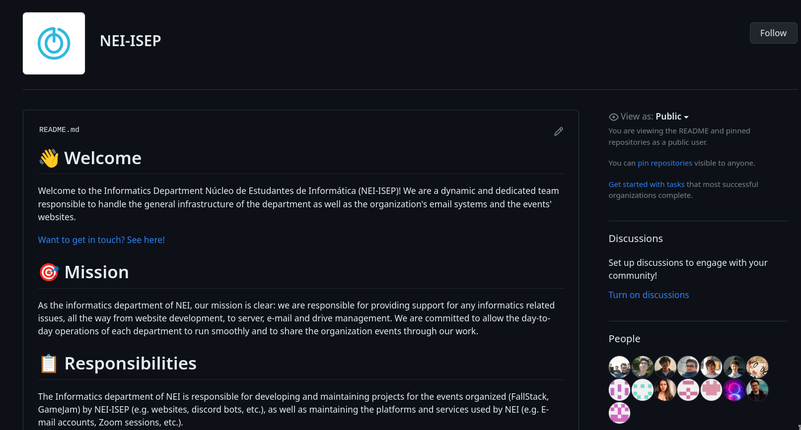

<!--
Para tudo isto funcionar temos um conjunto de membros apenas dedicados ao apoio informático da organização.

O departamento de informática constroi os websites para divulgar estes eventos, além de tratar dos assuntos de IT internos da organização.

Além disso, este ano, aceitou o desafio de criar uma plataforma direcionada a todos os estudantes dos cursos do departamento de Informática do ISEP, que vamos falar em detalhe já a seguir.
-->

---

<!--
header: "_O que é o NEI_ **AntiRecurso - Origem** _AntiRecurso - Desenvolvimento_ _AntiRecurso - Sucesso_ _Software Livre_"
_class: lead
-->

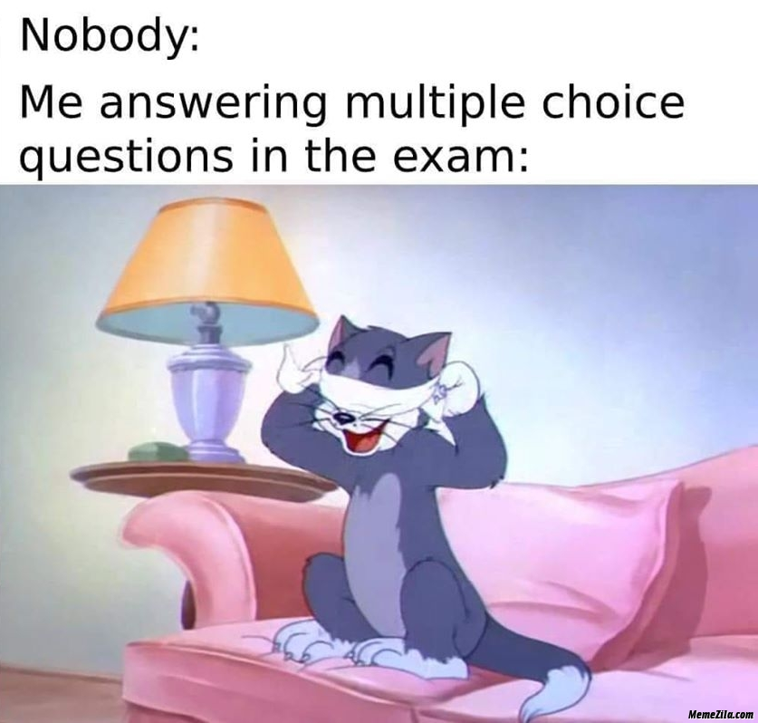

<!--
Como todos sabemos nenhum método de avaliação é perfeito, mas se há um que se destaca pela dificuldade de mostrar o que sabemos são as perguntas de escolha múltipla.

A mínima alteração na pergunta pode acabar por alterar o sentido da mesma, o que acaba por trazer, por vezes, resultados abaixo das expectativas iniciais.

Além disso, acresce o facto de todo o curso de Engenharia Informática ser muito prático.
  -> Programação temos feedback "imediato" se o código que fizemos faz o que esperavamos ou não.
Logo, estudar para este tipo de testes mais teóricos, acaba por ser uma tarefa complexa para a maioria dos alunos.

-->

---

<style scoped>
  p > img {
    position: absolute;
    right: 4rem;
    bottom: 50%;
    transform: translateY(50%);
  }
</style>

# Origem

Criado em 2018

Exclusivo Android

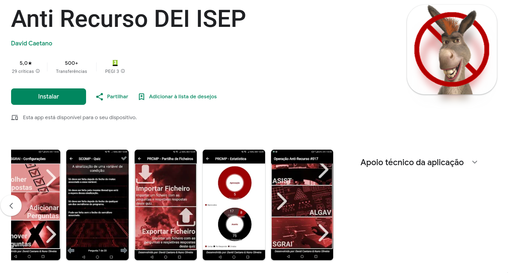

<!--
Sendo assim, nasceu em 2018, por iniciativa individual de dois alunos da LEI, a aplicação AntiRecurso.

A aplicação era exclusiva para Android e estava disponível na PlayStore.

Esta aplicação permitia aos alunos fazerem quizes de 20 perguntas de uma dada Unidade Curricular de forma a testarem os seus conhecimentos teóricos da mesma.

Talvez devido ao tempo que já passou, ou por falta de comunicação, ninguém sabe se o código fonte chegou ou não a ser disponibilizado livremente.
Além disso, ao longo dos anos muita da história acabou por se perder, mas pelo que nos foi transmitido as perguntas foram angariadas pelos dois alunos junto dos professores de várias cadeiras e inseridas manualmente na aplicação ao longo do tempo.

A aplicação tinha bastantes problemas conhecidos. Além da interface desatualizada e de alguns bugs que persistiam, algumas respostas estavam erradas o que levava muitos alunos a abandonarem este método de estudo de vez.
-->

---

<!--
header: "_O que é o NEI_ _AntiRecurso - Origem_ **AntiRecurso - Desenvolvimento** _AntiRecurso - Sucesso_ _Software Livre_"
_class: lead
-->

<style scoped>
  h1 {
    font-size: 3rem;
  }
</style>

# ♻️

<!--
Voltando ao presente, mais precisamente para o início do segundo semestre do último ano letivo, o departamento de informática do NEI aceitou o desafio de refazer esta aplicação.

Aplicando melhorias sugeridas pelos alunos ao longo dos anos e tentando tornar a plataforma o mais útil e intuitiva possível, vários membros começaram a trabalhar numa versão que pudesse ser lançada ainda na época de exames desse semestre.

Este projeto foi aberto disponibilizado abertamente sob uma General Public License no Github da organização do Núcleo.
-->

---

# Crawler

<style scoped>
  h1 {
    position: absolute;
    left: 2rem;
    top: 2rem;
  }
  h2 {
    font-size: 1.2rem;
  }
  section {
    display: grid;
    grid-template-columns: 1fr 1fr 10fr;

    align-items: center;
    gap: 0.5rem;
  }
  section code {
    width: 100%;
    font-size: 1.5rem;
  }
</style>


## ➡

```json
{
    "line": "8) Em x86-64, a instrução “popq %rax” é o equivalente a “movq %rax,(%rsp)” seguido de “subq...",
    "question_number": 8,
    "question": "Em x86-64, a instrução “popq %rax” é o equivalente a “movq %rax,(%rsp)” seguido de “subq $8,%rsp”",
    "options": [
      "Verdadeiro",
      "Falso"
    ],
    "correct_index": 1
  },
  {
    "line": "9) Em x86-64, se atribuirmos valores com sinal aos registos a somar, o resultado será incorreto se a flag ..."
    "question_number": 9,
    "question": "Em x86-64, se atribuirmos valores com sinal aos registos a somar, o resultado será incorreto se a flag..."
    "options": [
      "Verdadeiro",
      "Falso"
    ],
    "correct_index": 1
  },
  {
    "line": "10) Em x86-64, a instrução “movq %rax,%rsp” é o equivalente a “popq %rax” seguido de “addq $8,%rsp”",
    "question_number": 10,
    "question": "Em x86-64, a instrução “movq %rax,%rsp” é o equivalente a “popq %rax” seguido de “addq $8,%rsp”",
    "options": [
      "Verdadeiro",
      "Falso"
    ],
    "correct_index": 1
  }
```

<!--
Para tornar esta plataforma possível, era necessário, antes de tudo, uma forma de arranjar as perguntas e respostas para alimentar a plataforma, sem isto não existiriam exames para resolver.

Logo, foram criados dois crawlers (devido aos limites de tempo acabaram por sair tudo menos perfeitos).

O primeiro foi criado para extrair, a partir de um PDF com um exame resolvido disponibilizado pelos professores no Moodle, as perguntas e respostas.
  O problema aqui acaba por ser óbvio, apesar da base ser a mesma, para cada formato de resolução um novo crawler tem que ser criado. Foram criados 4 destes para 4 unidades curriculares diferentes.

O segundo, para extrair as perguntas da antiga aplicação, que por alguma razão, exportava as perguntas e respostas no formato de serialização do Java.
  Para quem tem experiência com Java sabe que estes dados são apenas úteis quando acompanhados do código fonte, como referimos anteriormente, se ele está disponível,
  a informação nunca nos chegou.
Desta forma foi criado um programa que lia o ficheiro serializável e fazia o match de referências de memória para extrair os dados na forma correta.
Um fun fact que se pode acrescentar é que neste versão a resposta correta estava guardada sempre na posição 0 do array de opções de resposta.
-->

---

# Desafios

<style scoped>
  p > img {
    position: absolute;
    right: 4rem;
    bottom: 50%;
    transform: translateY(50%);
  }
</style>

Timing

Recursos

Informação disponível

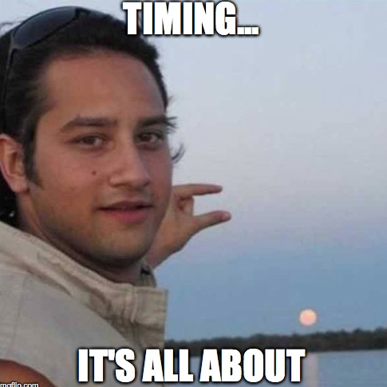

<!--
Como em quase todos os projetos de software, acabaram por surgir imprevistos que adiaram o lançamento de uma primeira versão de teste para a semana anterior ao início da época de exames.

Devido a falta de recursos, tempo e informação para a plataforma, o lançamento acabou por ocorrer apenas 5 dias antes do primeiro exame.
-->

---

<style scoped>
  section {
    display: flex;
    align-items: center;
    justify-content: space-between;
    gap: 1rem;
  }
  p {
    width: 607px;
    height: 361px;
    margin: 0;
  }
  p img {
    width: 100%;
    height: 100%;
  }
</style>

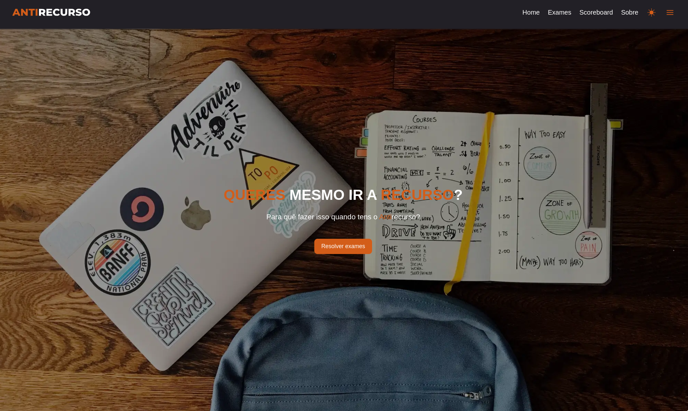

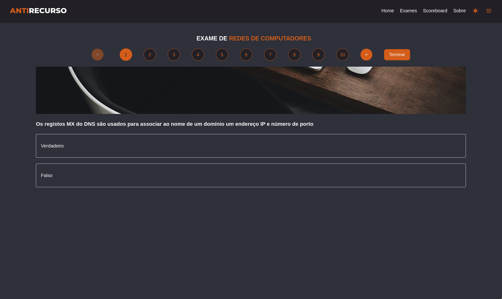

<!--
Apesar de todos os contratempos, a plataforma foi mesmo para o ar e os alunos aderiram em massa. Apesar de alguns problemas nos primeiros dias os alunos podiam finalmente ter uma plataforma que não se limitava a Android em que podiam responder a exames das Unidades Curriculares para as quais estavam a estudar.
A base de dados de questões estava completamente renovada, e a maioria das respostas erradas corrigidas.
-->

---

<style scoped>
  section {
    display: flex;
    align-items: center;
    justify-content: space-between;
    gap: 1rem;
  }
  p {
    width: 620px;
    height: 360px;
    margin: 0;
  }
  p img {
    width: 100%;
    height: 100%;
  }
</style>

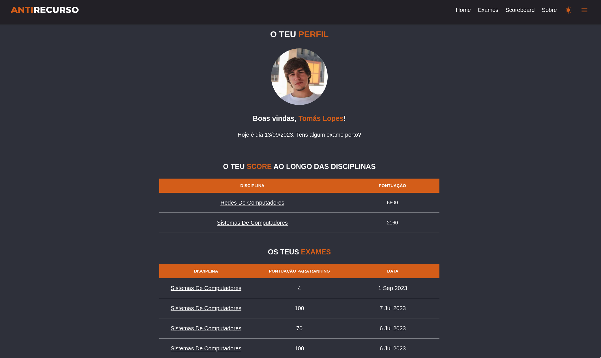

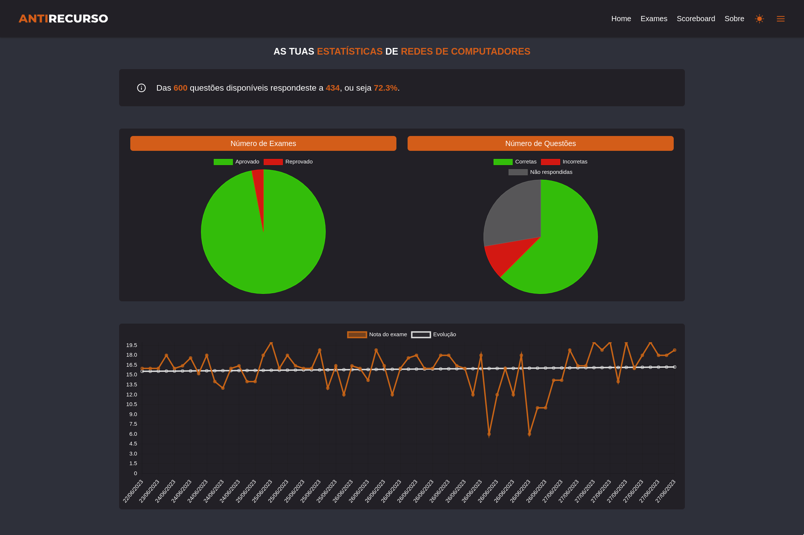

<!--
Ao longo da época de exames os membros do departamento de informática não pararam e continuaram a implementar novas features como perfil de utilizador com histórico de exames, estatísticas por Unidade Curricular e modos de exame (realista, perguntas erradas, perguntas novas) (muito à parecença do que acontece no Bom Condutor)
-->

---

<!--
header: "_O que é o NEI_ _AntiRecurso - Origem_ _AntiRecurso - Desenvolvimento_ **AntiRecurso - Sucesso** _Software Livre_"
-->

<style scoped>
  section {
    display: flex;
    align-items: center;
    justify-content: space-between;
    gap: 1rem;
  }
</style>

## 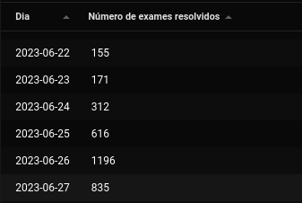

## 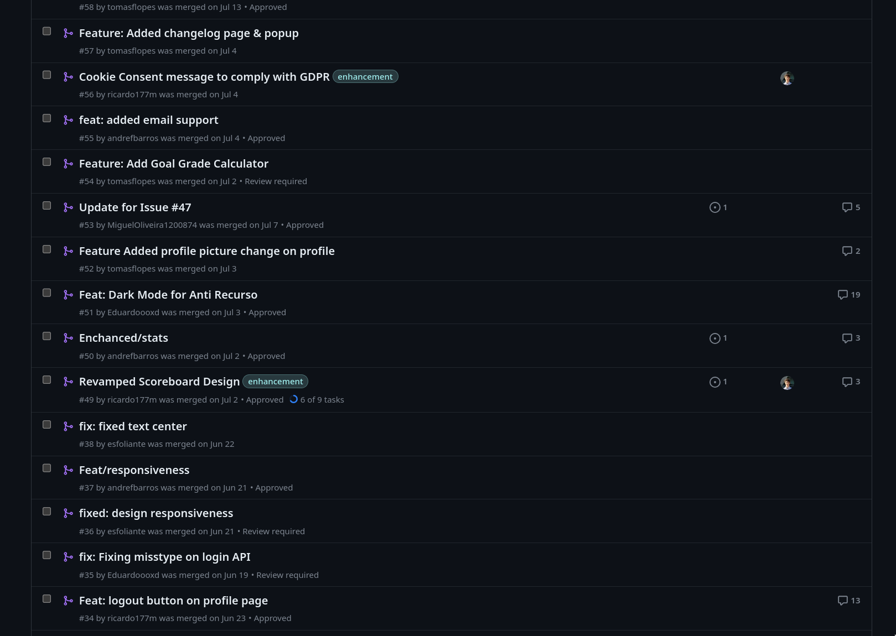

<!--
Com o avançar da época de exames o número de exames resolvidos só crescia, como podemos ver na imagem, chegamos a ter quase 1200 exames resolvidos num só dia, o que deixou todos os envolvidos no processo muito felizes. Além disso, as features não paravam de ser implementadas e no fim da época normal já quase não era possível reconhecer a aplicação que foi lançada no primeiro dia.
-->

---

<!--
_class: lead
-->

<style scoped>
  h1 {
    font-size: 2.5rem;
  }
</style>

# 🔜

<!--
Com o fim do semestre este ritmo de desenvolvimento abrandou (felizmente), mas as ideias continuam a surgir.
Como próximos passos para a próxima época de exames (que acreditamos que vá superar e muito esta que passou) temos:
  - Expandir a base de dados de perguntas
  - Possiblidade de novos tipos de perguntas (resposta aberta, código, match)
  - Partilha de resumos
  - Melhoria do sistema de comentários

-->

---

<!--
header: "_O que é o NEI_ _AntiRecurso - Origem_ _AntiRecurso - Desenvolvimento_ _AntiRecurso - Sucesso_ **Software Livre**"
_class: lead
-->

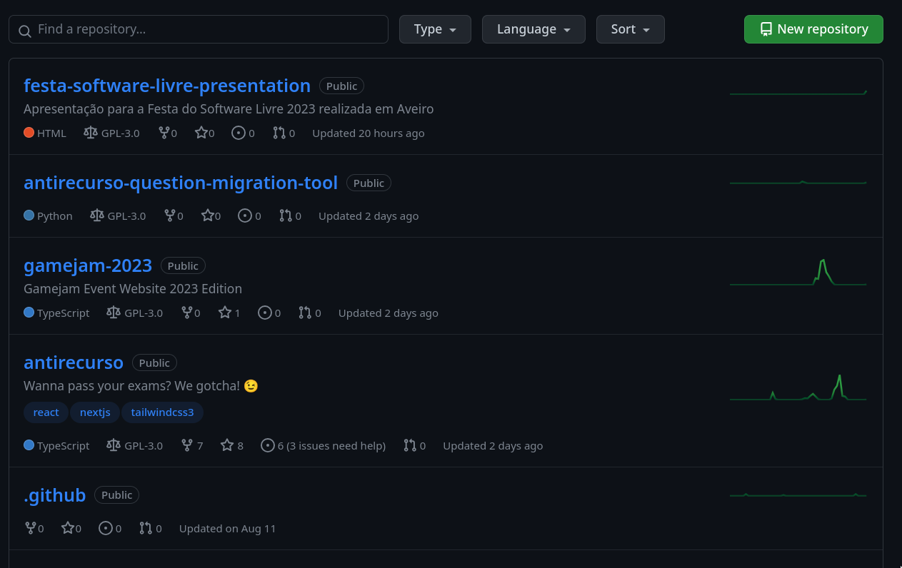

<!--
Graças ao sucesso deste projeto e do feedback fantástico que fomos recebendo por parte de alunos e professores, o departamento de informática mudou completamente a forma como
aborda o desenvolvimento dos projetos.

Antes, o Github servia apenas como forma de manter um grupo de pessoas a trabalhar no mesmo projeto de forma coesa.

Hoje em dia, temos muito mais cuidado com a plataforma, e disponibilizamos livremente, sob uma General Public License todos os projetos desenvolvidos no departamento
Desde websites de eventos, plataformas, ferramentas internas com alguma relevância para o público em geral, etc...

No fundo, o projeto do AntiRecurso abriu as portas do mundo do Software Livre ao NEI.
-->

---

<!--
_class: lead
-->

<style scoped>
  h1 {
    font-size: 2.5rem;
  }
</style>

# 📈

<!--
Graças a ter disponibilizado este material, acabamos por atrair mais atenção para o trabalho desenvolvido por este grupo de estudantes. Ficou à vista de todos
o que esta equipa consegue desenvolver quando se focam num objetivo e com isto, naturalmente, novas pessoas ficaram interessadas em juntar-se e fazer parte da mesma.
-->

---

<!--
_class: lead
-->


<!--
Além disso, e ao contrário do que já acontece há algum tempo noutras instituições, no ISEP não existe grande ligação entre os professores e o trabalho desenvolvido no Núcleo.
Mesmo assim, no fim da época de exames, a organização do Departamento de Informática no Github deu fork do projeto do AntiRecurso, o que nos traz esperança que o trabalho
desenvolvido no Núcleo seja cada vez mais relevante para os professores.
-->

---

<!--
_class: lead
-->

<style scoped>
  h1 {
    font-size: 2.5rem;
  }
</style>

# 📚

<!--
Mesmo que não seja usado diretamente por professores, todo este código disponível para todos, é útil para qualquer aluno que queira uma base para começar um novo projeto.

As tecnologias usadas no AntiRecurso não são lecionadas em nenhuma Unidade Curricular, logo, o projeto pode ser usado como material de estudo por qualquer pessoa
interessada nestas tecnologias, ou em saber mais sobre como é construída uma plataforma que possam eventualmente usar durante o estudo.
-->

---

<!--
_class: lead
-->


<!--
Além de todos estes pontos, o facto do software ser disponibilizado de forma livre trouxe ajuda externa preciosa que ajudou a tornar o projeto possível dadas
todas as limitações já referidas.
-->

---

<!--
_class: lead
-->

<style scoped>
  h1 {
    font-size: 2.5rem;
  }
  p {
    display: flex;
    align-items: center;
    gap: 0.25rem;
    margin-left: 2rem;
  }
  em > img {
    position: absolute;
    right: 8rem;
    bottom: 50%;
    transform: translateY(50%);
  }
</style>

 @nei_isep

 @nei_isep

 nei-isep.org

__

<!--
- Obrigado pela atenção, e se quiserem saber mais sobre o NEI, podem seguir-nos nas redes sociais ou visitar as nossas redes sociais.

- Referir slides são open source.
-->
